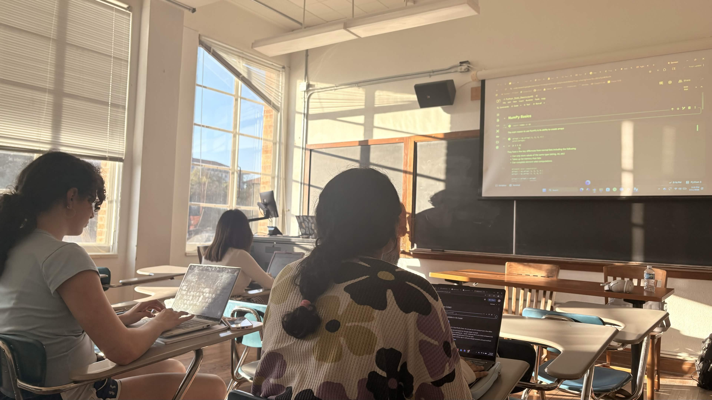
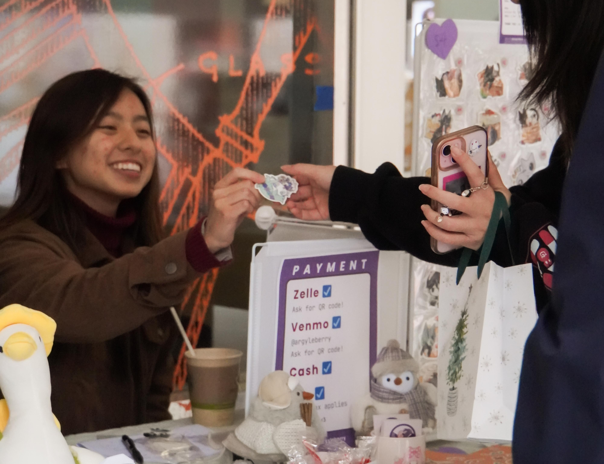

------------------------------------------------------------------------

## Bachelor's of Science in Statistics and Data Science

#### University of Texas at Austin - College of Natural Sciences

#### August 2024 - May 2028

## Bachelor's of Arts in Philosophy

#### University of Texas at Austin - College of Liberal Arts

#### August 2024 - May 2028

GPA: 4.00 / 4.00 Honors: Distinguished College Scholar (CNS, CoLA)

### Relevant Coursework

-   Linear Algebra; Introductory Data Science; Linear Regression;
    Probability & Statistical Inference; Data Structures & Algorithms;
    Elements of Databases; Big Data in Biology
-   Introductory Symbolic Logic; Cognitive Science; Technology Ethics;
    Ethical Theories; Language, Politics, and Culture; Classics of
    Social and Political Thought; International Relations

### Skills

#### Programming Languages

-   Python (Pandas)
-   R (tidyverse, ggplot, Seurat)
-   SQL (MySQL, PostgreSQL)

#### Technical Tools
-   Linux/Unix
-   Google Cloud Console
-   Excel
-   Smartsheet

#### Web Building
-   HTML
-   CSS
-   Rmd

#### Other
-   Photoshop

### Interests

-   Cognitive bias and belief formation
-   Statistical reasoning and uncertainty
-   Philosophy of science
-   Ethics of technology
-   Public policy analysis (education and technology policy)
-   Philosophy of mind

------------------------------------------------------------------------

## Leadership Roles

### Women in Data and Statistics

#### Role: Creative Officer

{#id .class width="40%" height="40%"} 

Women in Data and Statistics aims to encourage undergraduate women to pursue studies in topics such as data analytics, software engineering, and machine learning. As an officer, I work to organize workshops that range from coding tutorials to elevator pitch practice. 

My role as Creative Offer revolves around promoting the organization to potential members and growing engagement with existing members. I design fliers, posters, and merchandise (T-shirts, stickers), collaborating with other officers to ensure brand consistency and refine visual concepts through feedback and iteration.

### Texas Creative Union Project

#### Role: Event Coordinator

{#id .class width="40%" height="40%"} 

Twice a semester, the Texas Creative Union Project(TCUP) hosts student art markets where independent artists can sell hand-drawn and hand-crafted merchandise. As an Event Coordinator, I help organize these markets by verifying artist eligibility, coordinating logistics, and ensuring events run smoothly for both vendors and attendees.

In addition to markets, I help plan social and skill-building events designed to strengthen the TCUP community and support members who want to sell their work. These events include art exchanges, discussions about pricing and advertising artwork, and workshops where members share marketing and business strategies.

The organization also tables on campus once a month, creating real-time $1 portrait drawings to raise funds for art supplies and future markets.

### Ignite Texas

#### Role: Counselor

Ignite is a student-run Christian organization that hosts a four-day retreat for incoming freshmen and transfer students in Austin. The retreat aims to ease students into their transition to UT Austin by providing mentorship, community, and connections to campus organizations.

During the retreat, I lead a small group of students, facilitating discussions and supporting them as they build relationships and navigate questions about faith and college life. I continue leading these students into the fall semester, helping them adjust to campus life and connect with churches and student organizations that encourage both intellectual and personal growth during their time at school.

------------------------------------------------------------------------

## High School Degree

#### Logos Preparatory Academy

#### August 2020 - May 2024

GPA: 4.00 / 4.00 - Class Valedictorian

------------------------------------------------------------------------
