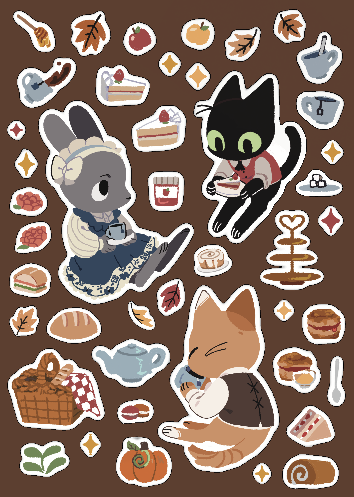
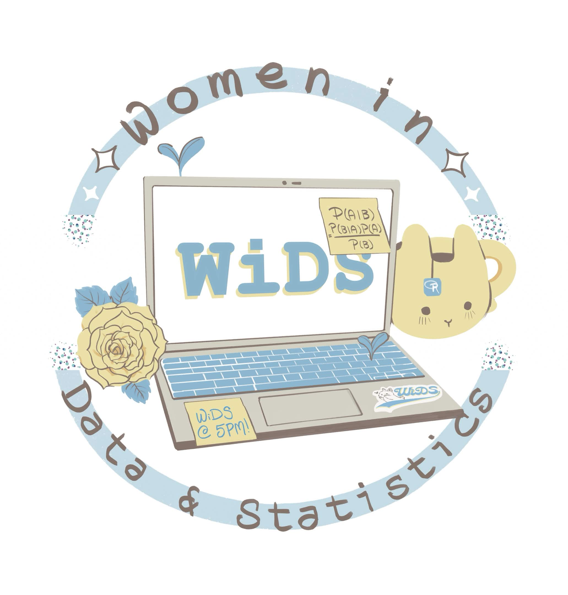
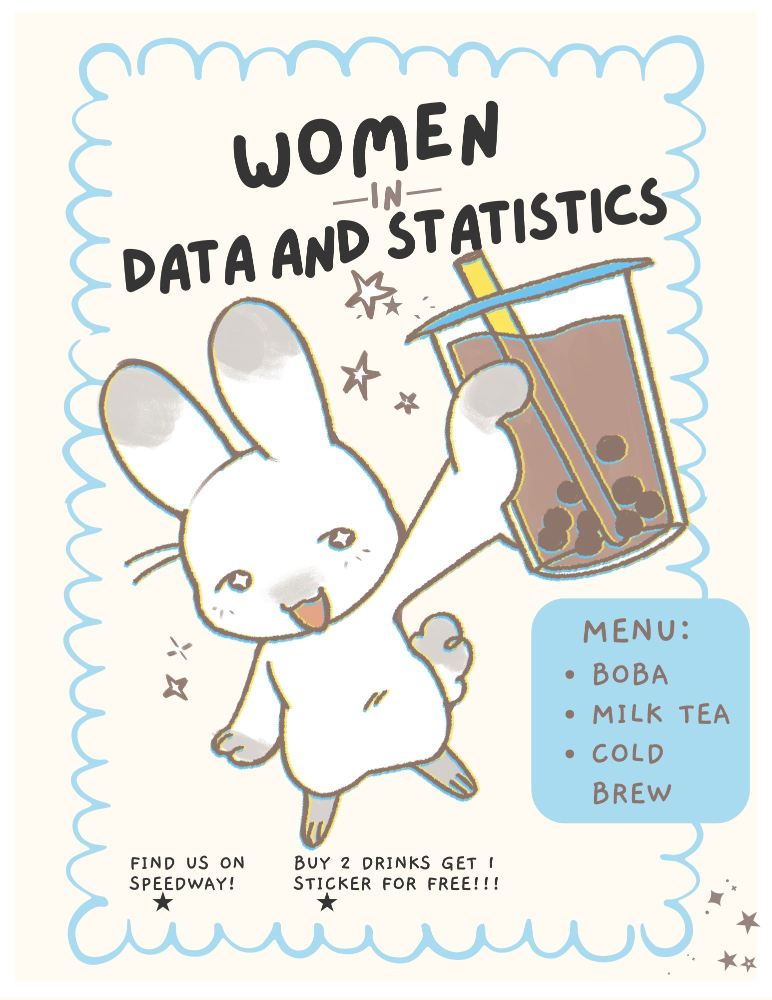
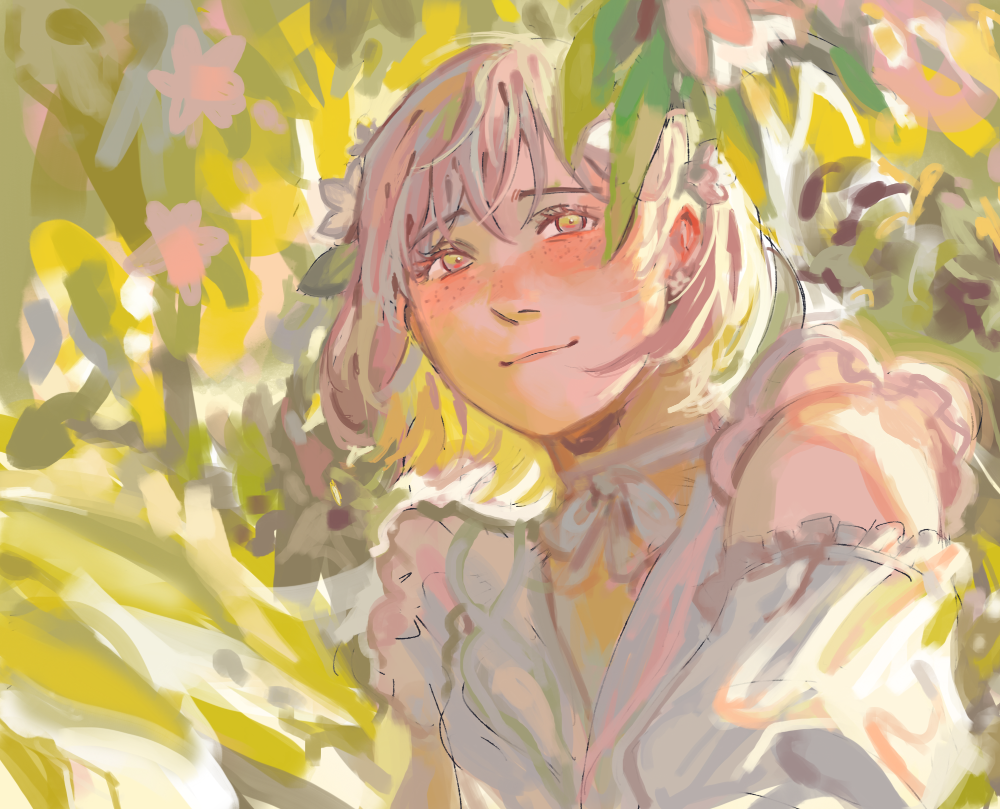
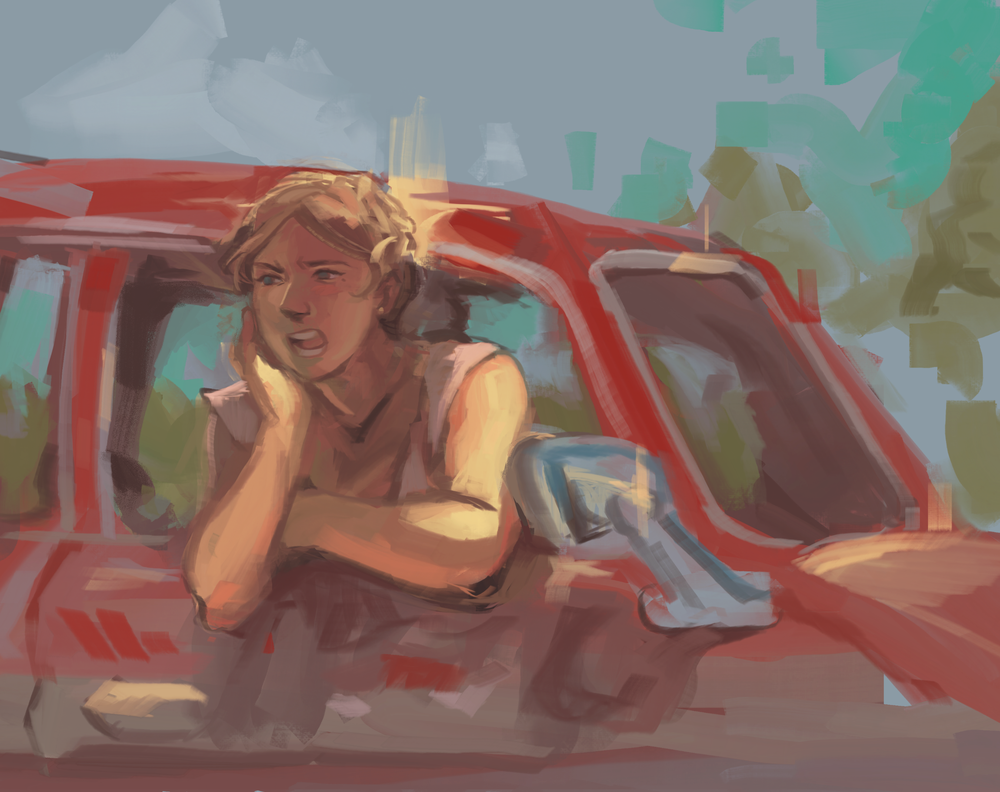

Whenever I find myself outside of the lab or cafés, I love doing digital art. In my free time, I manage a small business where I hand-draw illustrations for independent clients, organizations, and merchandise.

------------------------------------------------------------------------

## **On-Campus Business**

#### Austin, TX

#### Fall 2024 - Present

I specialize in selling vibrantly colored art printed on stickers, keychains, and posters. My best-sellers are a line of illustrations of cats with various baked goods. Markets involve sitting at a booth, usually with another student artist, for about five to six hours, chatting with customers, managing money, and answering questions any questions they may have.

::: {style="display:flex; flex-wrap:wrap; justify-content:center; gap:20px;"}
  
:::

## **Women in Data & Statistics Merch Designer**

#### Austin, TX

#### Spring 2026 - Present

For my role as Creative Officer, I have designed materials using software such as Procreate, Photoshop, and Canva.

::: {style="display:flex; flex-wrap:wrap; justify-content:center; gap:20px;"}
 
:::

## **Commissions for Clients**

#### Remote

#### Fall 2024 - Present

For several years now, I've taken commissions both online and in-person. I've done a variety of work for clients, including designing original characters, building on-model character sheets, or doing full-scale illustrations.

::: {style="display:flex; flex-wrap:wrap; justify-content:center; gap:20px;"}

:::

## **Personal Art**

Even between markets and commissions, I enjoy doing original pieces and sharing them with friends. I particularly enjoy designing characters from classic literature and illustrating their scenes. I'm inspired by whimsical, children's book illustrations, and I aim to capture that cute, comforting style in my art, whether it's intensely moody or gentle and cozy.

::: {style="display:flex; flex-wrap:wrap; justify-content:center; gap:20px;"}
   
:::

------------------------------------------------------------------------
