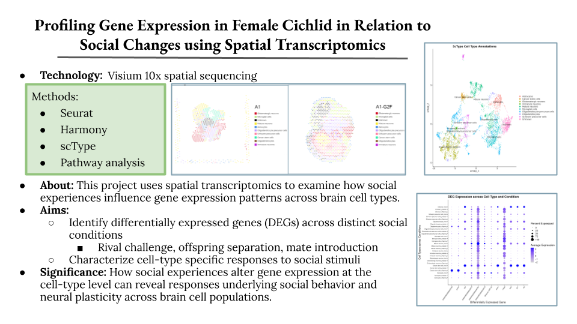

[image] [text]

------------------------------------------------------------------------

## **Homologous Structures of Mouse and Cichlid Brains**

### February 2026 - Present

[no image here yet...]

In order to investigate whether homologous brain regions share conserved spatial transcriptomic signatures, 10x Visium spatial transcriptomic data from the cichlid fish Amatitlania nigrofasciata were analyzed across six brain sections representing three behavioral conditions: mate guarding, offspring retrieval, and predator threat. Individual spots were manually annotated, and spatial gene expression patterns were compared with publicly available mouse spatial transcriptomic data.

Unsupervised clustering and dimensional analysis were used to identify distinct spatial domains in the cichlid and evaluate their correspondence with known, annotated mouse brain regions. These annotations included both coarse regions such as the hypothalamus and subpallium, as well as specific ones such as the preoptic area (POA). Cross-species comparisons were performed to assess whether homologous brain regions exhibit greater transcriptomic similarity to one another than to other regions within their respective species.

```{r eval=FALSE}

# my code will go hereee

```

#### Skills used: R (Seurat), Linux, visualization (UMAP, PCA, t-SNE, heatmaps), academic writing

## **Differential Expression in Cichlid Fish Across Social Environments**

### August 2025 - December 2025

{#id .cute_border width="40%" height="40%"}

This study, conducted in a laboratory group with four other undergraduate researchers, aimed to identify differential gene expression pathways in the brains of cichlid fish exposed to distinct social stimuli, featuring data from the Hofmann Lab. Two samples of spatial transcriptomics data came from female fish exposed to a rival, two more for separation from offspring, and the final two from introduction of a potential mate. Methods used include unsupervised clustering through UMAPs and t-SNEs, batch correction with Harmony, annotations through scType, and visualization of differential expression through heat maps and dot plots. The study found upregulation of reproductive and stress hormone production in the rival condition and concluded that the rival condition triggered hormones that cause behaviors of higher aggression, increased territory defense, boldness, and increased reproductive readiness.

Through comparing unsupervised clustering with brain region annotations, we also found evidence that regions has similar expression profiles. Cell spots clustered together spatially also had higher degrees of molecular similarity to each other. This helped validate the Hofmann Lab's manual annotations.

The project ended in a 22-page manuscript featuring data descriptions, methods, results, analyses, and potential next steps, all formatted into traditional scientific academia literature format.

<details>

<summary>Loading in libraries, data, and GitHub functions</summary>

```{r eval=FALSE}

# load analysis libraries
lapply(
  c("dplyr","Seurat","HGNChelper","openxlsx","biomaRt","pheatmap","ggplot2"),
  library,
  character.only = TRUE
)

# load harmonized spatial transcriptomics dataset
data <- readRDS("harmonized_samples.rds")

# load sctype cell annotation functions
source("https://raw.githubusercontent.com/IanevskiAleksandr/sc-type/master/R/gene_sets_prepare.R")
source("https://raw.githubusercontent.com/IanevskiAleksandr/sc-type/master/R/sctype_score_.R")

```

</details>

<details>

<summary>Batch Correction and Clustering</summary>

```{r eval=FALSE}

# correct batch effects between samples
data <- RunHarmony(
  data,
  group.by.vars = "Sample",
  plot_convergence = TRUE # output convergence plot
)

# re-cluster after integration
data <- data %>%
  FindNeighbors(reduction = "harmony") %>%
  FindClusters(resolution = 0.6) %>%
  RunUMAP(reduction = "harmony", dims = 1:30)

```

</details>

<details>

<summary>Ortholog Mapping</summary>

```{r eval=FALSE}

# goal: annotate convict cichlid cells
# problem: no available reference dataset for convict cichlid
# solution: use scType's human marker database and map markers to tilapia
# tilapia is used as an annotated reference species with available ortholog data
# these mapped markers are then matched to genes present in the convict cichlid dataset

# connect to ensembl tilapia dataset
ensembl_tilapia <- useEnsembl(
  biomart = "ensembl",
  dataset = "oniloticus_gene_ensembl"
)

# retrieve ortholog mapping between tilapia and human genes
# returns ensembl ids, tilapia gene symbols, and associated human genes
tilapia_orthologs <- getBM(
  attributes = c(
    "ensembl_gene_id",
    "external_gene_name",
    "hsapiens_homolog_associated_gene_name"
  ),
  mart = ensembl_tilapia
)

# build human to tilapia gene mapping table
human2tilapia <- tilapia_orthologs %>%
  
  # remove rows where the tilapia gene name is missing
  # ensures only valid ortholog mappings remain
  filter(!is.na(external_gene_name)) %>%
  
  # group rows by human gene name
  # a single human gene can map to multiple tilapia orthologs
  group_by(hsapiens_homolog_associated_gene_name) %>%
  
  # collapse each group into one row
  # collect all unique tilapia genes corresponding to that human gene
  summarise(
    tilapia_genes = list(unique(external_gene_name))
  )

```

</details>

#### Skills used: R (Seurat, Harmony), Linux, visualization (2D and 3D dimensionality reduction), presentation, academic writing

## **Differential Expression in COVID-19 Patients Across Sexes**

### March 2025 - May 2025

[image] [TEXT]

```{python python.reticulate = FALSE}

# i lowkey lost the code that went here lol

```

#### Skills used: Python (Pandas), Linux, presentation

## **Graduation Rates Analysis Across [FILL]**

### November 2024 - December 2024

[TEXT]

#### Skills used: R (tidyverse, ggplot, Shiny)

------------------------------------------------------------------------
